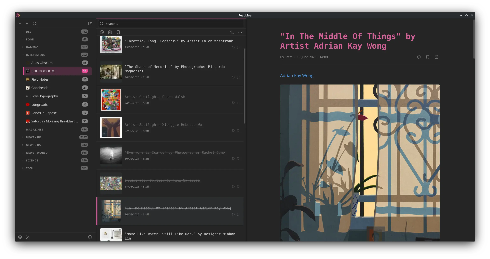

# FeedMee

*FeedMee* is an RSS/Atom news reader built for the desktop, cross-platform and Linux-first. It is fast, can handle many thousands of feeds and articles while remaining lightweight and responsive.

[Download from Latest Releases](https://github.com/dcog989/FeedMee/releases).




## Features

- **Cross-Platform:** Native performance on Windows, macOS, and Linux (via Tauri v2).
- **Three-Pane Layout:** Classic, responsive interface with keyboard-driven pane navigation.
- **Reader Mode:** Extracts full article content using `readabilityrs`, stripping clutter.
- **Feed Management:**
  - Auto-discovery of RSS/Atom links from URLs.
  - Drag-and-drop folder organization.
  - OPML Import/Export.
  - Bluesky profile support via AT Protocol.
- **Smart Views:** "Latest" (24h) and "Read Later" (Saved) aggregation.
- **Article Tagging:** Color-coded tags for categorization and filtering.
- **Search:** Full-text search across all articles or within a specific feed.
- **Thumbnails:** Automatic og:image extraction with resizing, WebP caching, and configurable size.
- **Local Privacy:** All data is stored locally in SQLite. No tracking, no accounts.
- **Auto-Refresh:** Configurable periodic refresh (default 30 min) with 5 concurrent workers and debounce support.
- **Blocked Phrases:** Filter out articles containing unwanted phrases.
- **Article Retention:** Configurable auto-pruning of old articles (default 90 days).
- **Auto-Updater:** Auto-update via GitHub Releases.
- **Customizable:** Dark/Light/System themes, configurable refresh intervals, thumbnail size, keyboard shortcut remapping, and log rotation.

## Tech Stack

| Layer | Technology |
|---|---|
| **Desktop Framework** | [Tauri v2](https://v2.tauri.app) |
| **Frontend** | [Svelte 5](https://svelte.dev) (Runes) + [SvelteKit](https://kit.svelte.dev) |
| **Language** | TypeScript, Rust |
| **Database** | SQLite via `rusqlite` |
| **HTTP Client** | `reqwest` (rustls) |
| **Feed Parsing** | `feed-rs` |
| **Content Extraction** | `readabilityrs`, `scraper` |
| **Image Processing** | `image` + `webp` |
| **Linting** | Biome (frontend), Clippy (backend) |
| **Bundling** | Vite |
| **Packaging** | AppImage (Linux), makepkg (Arch/CachyOS) |

## Getting Started

### Prerequisites

1. **Rust:** [Install Rust](https://www.rust-lang.org/tools/install)
2. **Bun:** [Install Bun](https://bun.sh)
3. **OS Dependencies:** Follow the [Tauri Prerequisites guide](https://v2.tauri.app/start/prerequisites/)

```bash
bun install
```

### Development

```bash
bun run dev
```

Starts the Vite dev server and Tauri with HMR.

### Install on Arch / CachyOS

```bash
bun run package
```

Runs `makepkg -si` from `.pkg/`, compiling from source and installing FeedMee to `/usr/bin/feedmee`.

**Build dependencies:** `rust`, `bun`, `npm`, `sqlite`, `cmake`, `nasm`

**Runtime dependencies:** `webkit2gtk-4.1`, `gtk3`, `libayatana-appindicator`, `sqlite`

### Build Release Binary

```bash
bun run build
```

Compiles the Rust backend and Svelte frontend. Output binary at `src-tauri/target/release/FeedMee`. No installer is produced locally — AppImage and Windows installer are built via GitHub Actions on tag push.

### Validate

```bash
bun run check
```

Runs TypeScript (`svelte-check`), frontend lint (`biome`), and backend lint (`cargo clippy`). Use `bun run check:watch` to keep running in a separate terminal during development.

## Keyboard Shortcuts

All shortcuts are customizable from Settings.

| Key     | Action                     |
| ------- | -------------------------- |
| `/`     | Focus search               |
| `r`     | Refresh all feeds          |
| `n`     | Add new feed               |
| `,`     | Open settings              |
| `s`     | Save/Read later            |
| `m`     | Mark as read/unread        |
| `Enter` | Open article in browser    |
| `x`     | Expand all folders         |
| `c`     | Collapse all folders       |
| `Esc`   | Close modal / Clear search |
